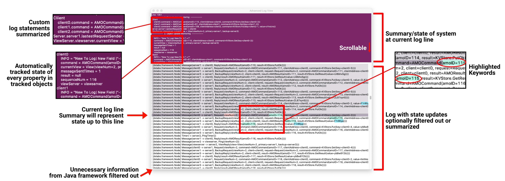
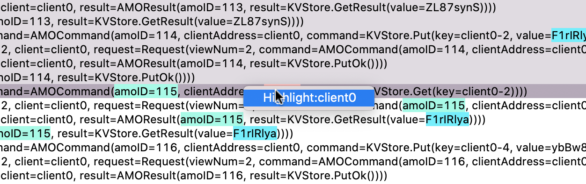

# Advanced Log Viewer - Beta
A python based cross-platform log viewer with powerful features like historical summaries and advanced highlighting.

## Why this tool?
1. You should never have to scroll backwards in a log to determine your state at a current line
2. Extensive state update printing crowds your log
3. Highlighting

#### Screenshot


### Warning
This is a beta software. I wrote this very quickly while also trying to get through University coursework. It is littered with typos and probably errors too. There will be bugs. Some of them may crash the software, others may cause the console to subtly print out warnings, others may cause correct input. For the most part it will be correct but if something really does not make sense make sure to look at the log in a different viewer or ignore the top view.

## ToDo List
- Add ctrl+f
- Add jump to specific line
- Add stable upper log viewing
- Implement moveable divider in upper log
- Make more general (EX: move classMonitoringTools out of classMonitoringTools)

## Feature List

### Functionality example (dslabs)


### Highlighting
Right out of the box you can view any log with highlighting.

Highlighting allows you to right click on any word or after highlighting some text and highlight all instances of a word. They can also be un-highlight from this menu.




### Summary View
On the top of the window you may place summary information about your log. This should be based on the log file up to whatever the currently viewed line is.

## Getting Started

Clone the repository and set up git lfs
```
git clone https://github.com/CalebKierum/Advanced-Log-Viewer.git
cd Advanced-Log-Viewer
brew install git-lfs
git lfs install
```

Get tkinter set up by following [their instructions](https://tkdocs.com/tutorial/install.html)

*Please* star this repository and add yourself to the [mailing list](https://docs.google.com/forms/d/e/1FAIpQLSd4fPueq41fnBUC0aKEtaM3WC31PLlD0ZdXX7NpaGH-u3LweQ/viewform?usp=sf_link) so that you get updates while this is in development. This is CRITICAL so that you get bug fixes and accuracy errors quickly.

Please file errors for any crashes/bugs/errors you would like fixed

## DSLabs


This tool was specifically designed for this use case. To plug in your project all you need to do is add statements into the logging code so that the extra lines are printed out. You will want to join all output by piping it into a file.
```
./run-tests.py --assertions -g FINEST --lab 2 &> testAll.log  
# Please note this may take awhile and you cannot see progress in terminal as you go due to the pipe operator
```
Then open the log inside of this program
```
python3 ds_log_view.py testAll.log
```
Follow the instructions given by the console to open it up!

To populate the upper view you will need to add the `dslabs/Plugin/Alt.java` file to your code and make calls to it. See "Attaching State Updates" and "Attaching Class Updates"

### Populating DSLabs Summary View
#### Attaching State Updates


State updates track any value you want to follow even if it isn't a property.
All you need to do is make calls to `ALT.log(...)` which can take any length of arguments.
These arguments should be like key paths to the value you are logging for example to have the summary view show whether each given server is a primary or a backup you might have your server code call
```
ALT.log("Server", address(), "state", "primary")
```
or
```
ALT.log("Server", address(), "state", "backup")
```

The update tracker will automatically collapse any arguments that do not change so
```
ALT.log("Server", "server1", "state", "primary")
```
would show up as
```
Server.server1.state = primary
```

Wheras

```
ALT.log("Server", "server1", "state", "primary")
ALT.log("Server", "server2", "state", "back")
```
would show up as
```
Server
    server1.state = primary
    server2.state = backup
```


#### Attaching Class Updates


This framework can also automatically track your Node's and their state (including private state). 

To set this up you need to let `ALT` know about the object. Just pass the node into the framework with `ALT.trackNode(object)` at some point... preferably in the constructor. For the most part ALT will take care of everything as it holds a weak reference so it should not effect tests.

Please note that the framework has the option to serialize/deserialize this object at will. If you are worried about that happening and still want to keep the trace add the following method to your class
```
    private void readObject(java.io.ObjectInputStream in)
            throws IOException, ClassNotFoundException {
        in.defaultReadObject();
        ALT.trackNode(this);
    }
```
this makes sure that the object is tracked even after de-serialization

In order to avoid log clutter you do need to call `refresh()` every time you have changed a few state items.
It is essentially a flushing mechanism that helps small updates be batched into larger ones within the log.
I recommend calling refresh from the end of every message handler etc.

## Feature Requests
Please open any and all feature requests as Issues

## Bugs
Please do report any and all errors you find. If it crashes or behaves incorrectly I would much appreciate hearing about it.

## Contributing
Submit a pull request! I would love any and all help with this. If you know how to beautify the code in any way I appreciate that greatly.
